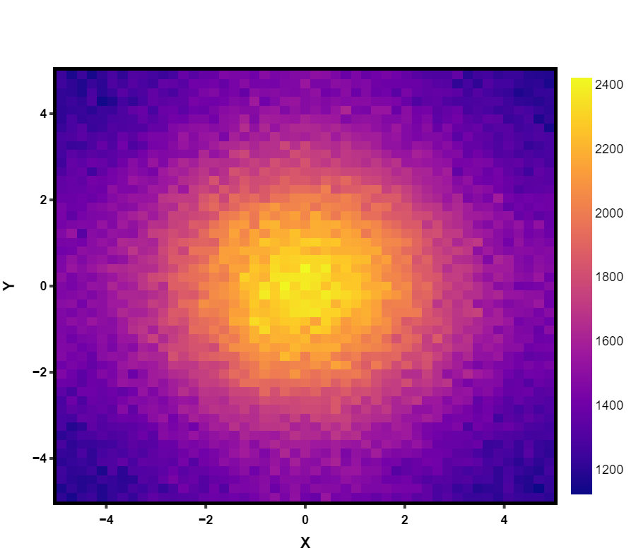
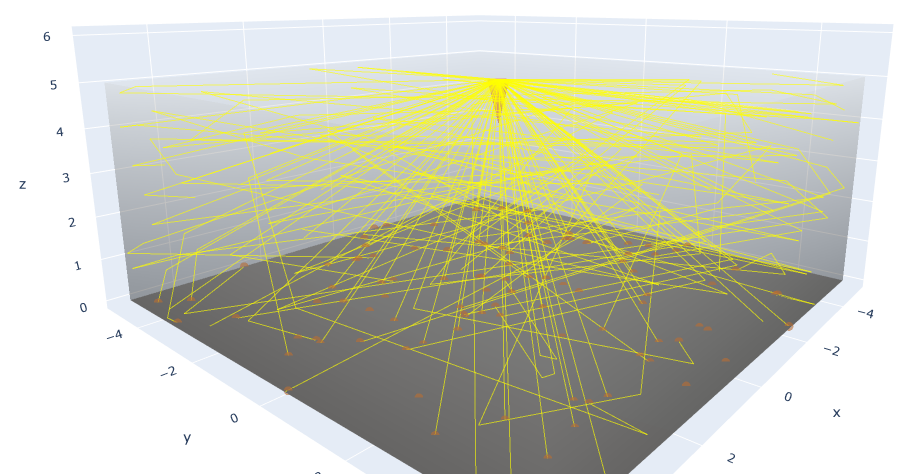
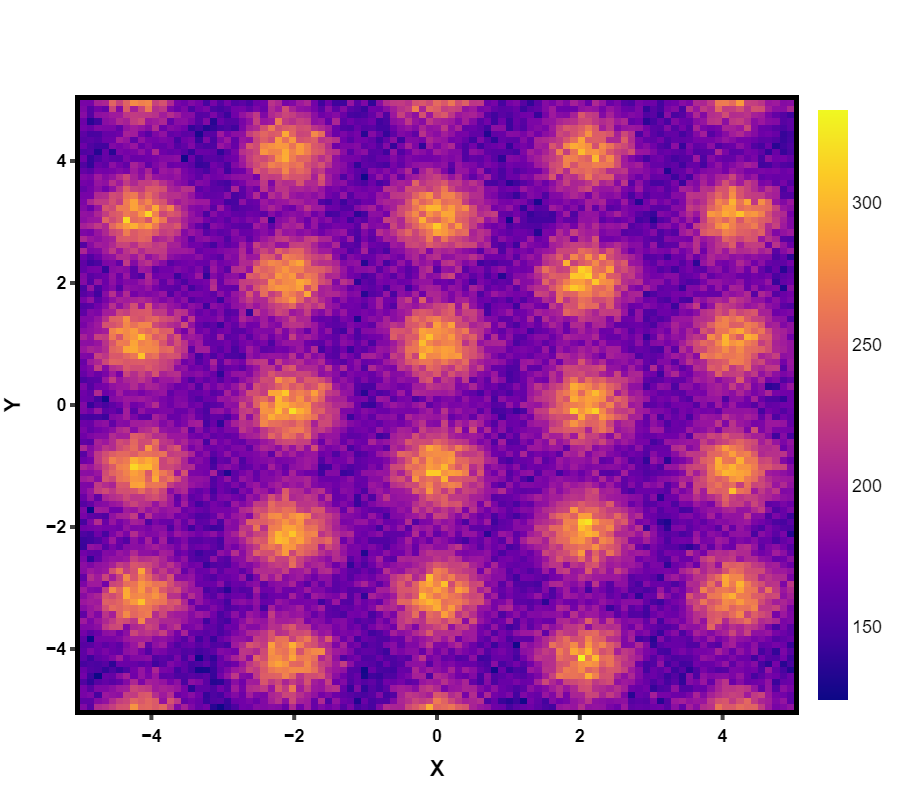
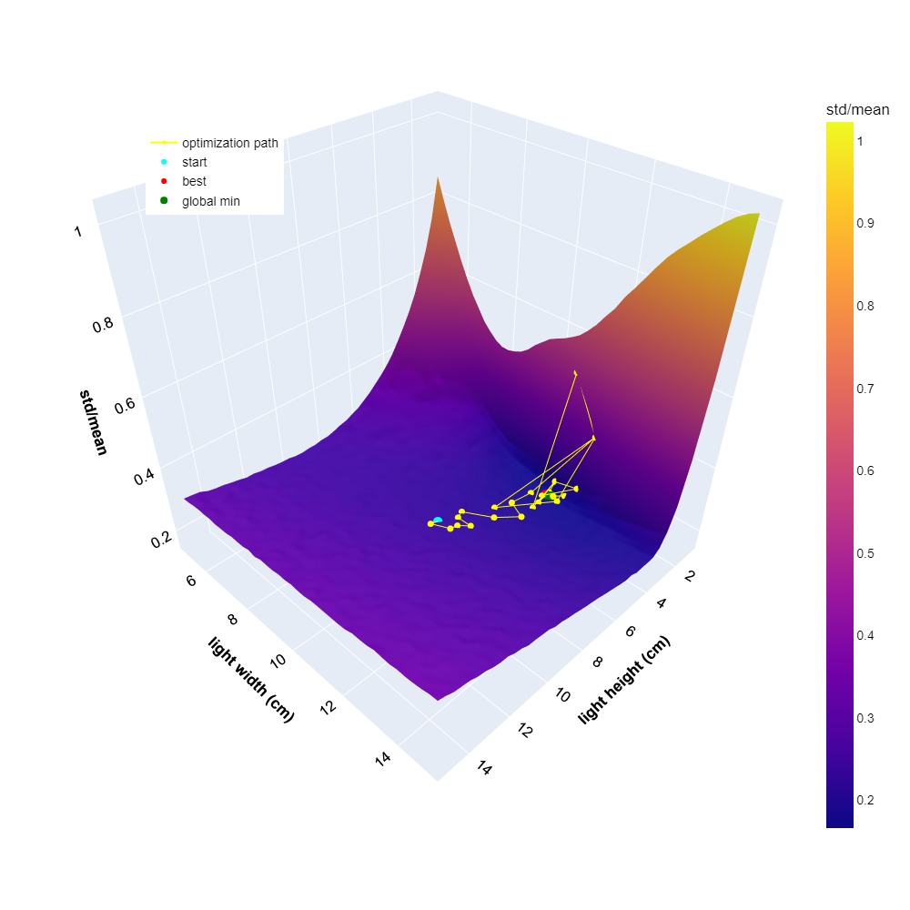

# Reactor Light Simulation Tool

---
---


This python package contains a raytracing light simulation.

---

## Installation

```
pip install raytracepy
```

## Dependencies
    numpy>=1.19.0
    numba>=0.53.1
    plotly>=5.3.1
    scipy>=1.7.1
    pandas>=1.4.1
    datashader>=0.13.0


---
---

## Examples

See the [examples](examples) folder for alot of details.

Here is some figures that can be produced:










